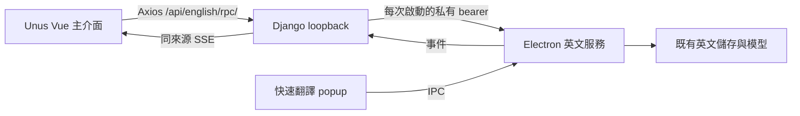

# Unus 統一系統

## 啟動與介面

從根目錄執行 `./run.ps1` 或 `npm run dev`。Electron 主視窗與瀏覽器共用
`investment/frontend`，首頁是 `/portal`。開發時由 Electron 建立 Django 與
統一 Vite，各自使用可用的 loopback 埠；當次網址可從系統匣「在瀏覽器開啟」取得。
`investment/run.ps1` 轉接根目錄入口。

安裝版由 Django 提供同一份前端建置結果。快速翻譯 popup 與首次模型設定
保留 Electron renderer；原英文主頁不再作為主視窗入口。

## 英文資料流

`src/main/englishService.ts` 管理允許的操作與事件，既有業務回呼同時供 IPC
及 HTTP 使用。內部服務只監聽 `127.0.0.1`；私有憑證只傳給 Django，前端不持有。
Django 檢查來源與客戶端標頭。SSE 重連會取得最新模型和逐字稿狀態。
頁面卸載會移除自身訂閱，無訂閱時關閉連線。

英文頁面依序位於 `/english/translate`、`/english/learn`、`/english/youtube`、
`/english/ielts`、`/english/history`、`/english/news`。
設定統一位於 `/settings` 的「英文平台」分頁。外觀由既有主題選單管理；
主題及英文設定經英文本機服務保存，桌面與瀏覽器共用。

## 資料與生命週期

英文資料與模型沿用 `%APPDATA%/lexicon`；投資資料沿用其下 `investment/`。
各自的既有服務仍負責資料庫，不搬移個人資料。原生備份資料夾對話框由
Electron 開啟，因此瀏覽器的英文功能需要 Unus 同時運行。

結束程式會停止英文本機服務、Django 與受管理 Vite。單一實例鎖避免重複
建立主程式；服務異常時可從系統匣重新開啟。投資的模擬／正式環境、
Trade PIN 與正式交易開關沿用原設定。

## 驗證範圍

已執行前後端型別與建置檢查、英文轉接與來源驗證、SSE 快照重播、
資料儲存測試、英文路由回歸，以及瀏覽器導覽與窄螢幕入口檢查。
原生快捷鍵、實際模型下載、YouTube Extension 播放同步與安裝包
仍需在對應原生環境完成操作驗收。
